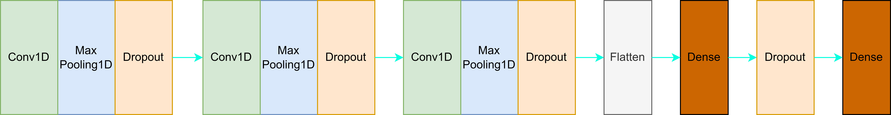

# ECG Heart Disease Classification (PTB-XL & CPSC2018)

Hybrid deep learning pipeline for ECG heart-disease classification:
- **PTB-XL**: custom CNN trained end-to-end.
- **CPSC2018**: **ResNet50** feature extraction + **Logistic Regression** classifier.

## Highlights
- Class imbalance handled via `class_weight`.
- Hyperparameter tuning (e.g., learning rate, regularization).
- Reproducible training/evaluation scripts.

## Tech Stack
PyTorch, TensorFlow, scikit-learn, SciPy, seaborn, torchvision, Colab, PyCharm.

## Methods
- **PTB-XL pipeline**: custom CNN with convolutional blocks → training with class weights → evaluation.
- **CPSC2018 pipeline**: ResNet50 pretrained (feature extractor) → Logistic Regression on extracted embeddings.

## Repo Structure
```bash
ecg-classification-ptbxl-cpsc2018/
│
├─ notebooks/                  # Jupyter notebooks (EDA, prototyping, training logs)
│   ├─ Dataset_Wrangling.ipynb
│   ├─ Train_on_PTB_XL_Dataset.ipynb
│   └─ Train_on_PTB_XL_Dataset2.ipynb
│
├─ src/                        # Source code
│   ├─ data/                   # data loading & preprocessing
│   │   ├─ filtered_csv.py
│   │   ├─ get_age_from_file_hea.py
│   │   ├─ split_file_train_200.py
│   │   └─ split_file_test.py
│   │
│   ├─ features/               # feature extraction, signal → image
│   │   ├─ find_peaks_i_w.py
│   │   ├─ count_find_peaks.py
│   │   ├─ make_image_i_w.py
│   │   ├─ make_image_i_w_base_on_age.py
│   │   ├─ make_binary_image.py
│   │   ├─ make_binary_image_i_w.py
│   │   ├─ make_binary_image_i_w_base_on_age.py
│   │   └─ merge_img.py
│   │
│   ├─ visualization/           # plotting, checking signals/images
│   │   ├─ binary_image_show.py
│   │   ├─ binary_image_show_i_w.py
│   │   ├─ binary_image_show_i_w_base_on_age.py
│   │   ├─ check_image_244_244.py
│   │   ├─ matrix_npy_show.py
│   │
│   ├─ transforms/              # augmentation & preprocessing transforms
│   │   ├─ transform_1.py
│   │   └─ transform_2.py
│   │
│   └─ models/                  # model architectures & training scripts
│       ├─ train_model1.py
│       └─ train_model2.pyy 
│
├─ assets/
│   ├─ cnn_architecture.png
│   ├─ cnn_training_pipeline.png
│   └─ resnet_training_pipeline.png
|   
└─ README.md

## Model Architectures & Training Pipelines

### CNN Architecture (PTB-XL)


### Training Pipeline – CNN (PTB-XL)


### Training Pipeline – Pretrained ResNet50 + Logistic Regression (CPSC2018)


